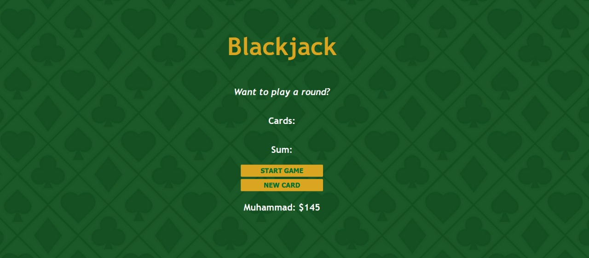

# Blackjack Game

Welcome to my simple Blackjack game built using HTML, CSS, and JavaScript! This project was created as part of a course on Scrimba.

## Game Rules
Blackjack, also known as 21, is a popular card game played in casinos around the world. The objective is to beat the dealer by having a hand value closer to 21 without going over.

## Screenshots

## Play the Game
To play the game, visit the following link:
[Blackjack Game](https://blackjack-game-alpha.vercel.app/)

Feel free to explore the code and make improvements!

